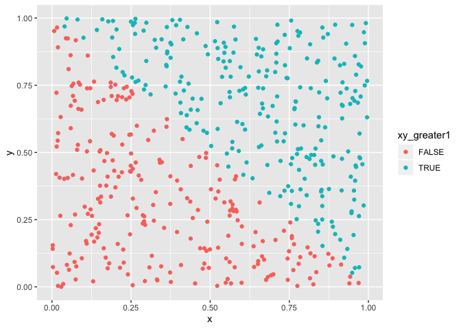

P8105: Homework 1
================
Molly Martorella
9/14/2019

# Problem 1

Load R
    **libraries**:

``` r
library(tidyverse)
```

    ## ── Attaching packages ────────────────────────────────────────────── tidyverse 1.2.1 ──

    ## ✔ ggplot2 3.2.1     ✔ purrr   0.3.2
    ## ✔ tibble  2.1.3     ✔ dplyr   0.8.3
    ## ✔ tidyr   0.8.3     ✔ stringr 1.4.0
    ## ✔ readr   1.3.1     ✔ forcats 0.4.0

    ## ── Conflicts ───────────────────────────────────────────────── tidyverse_conflicts() ──
    ## ✖ dplyr::filter() masks stats::filter()
    ## ✖ dplyr::lag()    masks stats::lag()

Create a **dataframe** called *p1\_df*:

``` r
p1_df <- tibble(
  samp_norm = runif(8),
  samp_greater0 = samp_norm > 0,
  char = sample(LETTERS, 8),
  cats = factor(x = c("orange", "white", "tiger", "tiger", "orange", "white", "white", "tiger"))
)
```

Attempting to take the **mean** of each variable in *p1\_df*:

``` r

mean(pull(p1_df, samp_norm))
## [1] 0.4625973
mean(pull(p1_df, samp_greater0))
## [1] 1
mean(pull(p1_df, char))
## Warning in mean.default(pull(p1_df, char)): argument is not numeric or
## logical: returning NA
## [1] NA
mean(pull(p1_df, cats))
## Warning in mean.default(pull(p1_df, cats)): argument is not numeric or
## logical: returning NA
## [1] NA
```

The mean of *samp\_norm* is 0.4625973, and the mean of *samp\_greater0*
is 1. Means were not calculated for the variables *char* and *cats*
because these variables are not numeric or logical.

Attempting to **convert variables to numeric** type:

``` r
as.numeric(pull(p1_df, samp_greater0))
as.numeric(pull(p1_df, char))
as.numeric(pull(p1_df, cats))
```

The implicit coercion heirarchy in R is: logical \< integer \< numeric
\< complex \< character. Here we attempting to forcibly coerce our
variables to numeric. The logical variable *samp\_greater0* outputs 1’s
because TRUE and FALSE are coerced to 1 and 0, respectively. The
character variable *char* cannot be coerced to numeric, and produces NA.
The variable *cats* is of the class factor but has a type of integer,
and thus is coerced to numeric based on the levels 1-3 that are present.
The mean function requires the data type to be numeric or logical and
does not automatically coerce the input to these types. However, it
would be possible to take the mean of the integer variable if the
function as.numeric were applied inside of the mean function.

Performing **operations with converted variables**:

``` r

as.numeric(pull(p1_df, samp_greater0))*pull(p1_df, samp_norm)
## [1] 0.03973710 0.60938223 0.14407093 0.48991480 0.09756401 0.67026332
## [7] 0.66739371 0.98245261

as.factor(pull(p1_df, samp_greater0))*pull(p1_df, samp_norm)
## Warning in Ops.factor(as.factor(pull(p1_df, samp_greater0)), pull(p1_df, :
## '*' not meaningful for factors
## [1] NA NA NA NA NA NA NA NA

as.numeric(as.factor(pull(p1_df, samp_greater0)))*pull(p1_df, samp_norm)
## [1] 0.03973710 0.60938223 0.14407093 0.48991480 0.09756401 0.67026332
## [7] 0.66739371 0.98245261
```

# Problem 2

Creating a **dataframe** called *p2\_df*:

``` r
p2_df <- tibble(
  x = runif(500),
  y = runif(500),
  xy_greater1 = ((x + y) > 1),
  xy_numeric = as.numeric(xy_greater1),
  xy_factor = as.factor(xy_greater1)
)
```

The *p2\_df* dataset has 500 rows and 5 columns.

The variable *x* has a mean of 0.4979203, a median of 0.4852442, and a
standard deviation of 0.2797905.

The proportion of cases where *x + y \> 1* is 0.478.

**Plotting** a scatterplot of *x* vs *y* with data points colored based
on logical variable *xy\_greater1*:

``` r
ggplot(p2_df, aes(x = x, y = y, color = xy_greater1)) +
  geom_point()
```

<!-- -->

Now plotted with *xy\_numeric* as color:

``` r
ggplot(p2_df, aes(x = x, y = y, color = xy_numeric)) +
  geom_point()
```

<!-- -->

And finally using *xy\_factor* to color the points:

``` r
ggplot(p2_df, aes(x = x, y = y, color = xy_factor)) +
  geom_point()
```

<!-- -->

The color scales for the first plot using *xy\_greater1* and the third
plot using *xy\_factor* appear the same because both variables are
categorical. The middle plot using *xy\_numeric* to color the points
uses a continuous scale because the variable is numeric and its
potential to be any value within the range needs to be represented.

**Exporting** first scatterplot to project directory:

``` r
plot1 <- ggplot(p2_df, aes(x = x, y = y, color = xy_greater1)) +
  geom_point()

ggsave("plot1.pdf", plot = plot1, device = "pdf")
```

    ## Saving 7 x 5 in image
